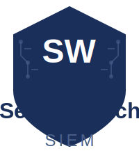

# SecureWatch - Enterprise SIEM Platform

[](https://securewatch.readthedocs.io/en/latest/?badge=latest)

<p align="center">
  
</p>

<p align="center">
  <strong>Enterprise-Grade Security Information and Event Management Platform</strong>
</p>

<p align="center">
  
  
  
  
  
  
  
</p>

<p align="center">
  
</p>

## 🚀 Enterprise-Grade Security Platform

SecureWatch is a comprehensive Security Information and Event Management (SIEM) platform that rivals enterprise solutions like Splunk, Sentinel, and QRadar. Built for modern security operations, it provides advanced threat detection, real-time analytics, and comprehensive data ingestion capabilities.

**🔥 Latest Release v2.10.0: Updated 2025-06-09**  
**95,000+ lines eliminated** • **13 core services** • **Zero TypeScript errors** • **Next.js 15 App Router compatible** • **Full type safety** • **Enterprise-ready**

### 🎯 What's New in v1.9.0

- ✅ **TypeScript Excellence**: Zero compilation errors across all 51+ files
- ✅ **Next.js 15 Compatibility**: Full App Router support with async route handlers
- ✅ **Type Safety**: Complete type coverage for SIEM operations and security events
- ✅ **Developer Experience**: Enhanced IntelliSense and compile-time error prevention
- ✅ **Architecture Consolidation**: Streamlined from 12+ services to 8 core microservices
- ✅ **Build System**: All packages compile successfully with proper type checking

## ⭐ Key Features

### 🚀 Splunk-Compatible Data Ingestion

- **HTTP Event Collector (HEC)**: Full Splunk API compatibility with token authentication
- **Universal Syslog**: Support for UDP 514, TCP 514, TCP 601 (RFC 5425), TLS 6514
- **File Upload API**: Drag-and-drop interface for CSV, XML, JSON, EVTX files
- **Enhanced Agent**: Persistent queuing with guaranteed delivery and compression

### 🔍 Advanced Analytics & Search

- **KQL Engine**: Microsoft Sentinel-compatible query language
- **Real-time Processing**: Stream processing with <100ms latency
- **Interactive Visualizations**: Heatmaps, network graphs, geolocation maps
- **Customizable Dashboards**: Drag-and-drop security widgets

### 🛡️ Enterprise Security Features

- **Threat Intelligence**: VirusTotal, AbuseIPDB, MISP integration
- **MITRE ATT&CK**: Automatic technique detection and mapping
- **Correlation Engine**: Real-time pattern detection and alerting
- **UEBA**: User and Entity Behavior Analytics

### 📊 Compliance & Reporting

- **SOX, HIPAA, PCI-DSS**: Built-in compliance frameworks
- **Automated Reporting**: Scheduled reports with multi-format export
- **Audit Trail**: Complete activity logging and forensic capabilities
- **Data Retention**: Configurable retention policies with hot/cold storage

## 🏗️ Architecture v1.9.0 - Consolidated & Optimized

```
┌─────────────────────────────────────────────────────────────────┐
│          SecureWatch SIEM Platform v1.9.0 (8 Core Services)    │
├─────────────────────────────────────────────────────────────────┤
│  🌐 Frontend Layer (Single Enterprise Implementation)           │
│  ┌────────────────────────────────────────────────────────────┐ │
│  │                 Next.js 15 Enterprise Frontend (4000)       │ │
│  │    🎨 Professional Dark Theme • 📱 Responsive Design        │ │
│  │    🔧 Fixed Hydration • 🏢 Official SecureWatch Branding    │ │
│  └────────────────────────────────────────────────────────────┘ │
├─────────────────────────────────────────────────────────────────┤
│  📡 Data Ingestion Layer (Multi-Protocol Support)              │
│  ┌─────────────┐ ┌─────────────┐ ┌─────────────┐ ┌──────────┐  │
│  │ HEC Service │ │   Syslog    │ │ File Upload │ │  Python  │  │
│  │ Splunk API  │ │ UDP/TCP/TLS │ │  Drag&Drop  │ │  Agent   │  │
│  │   (8888)    │ │(514,601,6514│ │   via Web   │ │ Enhanced │  │
│  └─────────────┘ └─────────────┘ └─────────────┘ └──────────┘  │
├─────────────────────────────────────────────────────────────────┤
│  ⚡ Core Processing Services (Consolidated Architecture)        │
│  ┌─────────────┐ ┌─────────────┐ ┌─────────────┐ ┌──────────┐  │
│  │Log Ingestion│ │Search & KQL │ │Correlation  │ │Analytics │  │
│  │Multi-Format │ │   Engine    │ │   Engine    │ │ Engine   │  │
│  │   (4002)    │ │   (4004)    │ │   (4005)    │ │ (4009)📊 │  │
│  └─────────────┘ └─────────────┘ └─────────────┘ └──────────┘  │
│  ┌─────────────┐ ┌─────────────┐ ┌─────────────┐ ┌──────────┐  │
│  │Auth Service │ │Query        │ │    MCP      │ │   CLI    │  │
│  │JWT/MFA/RBAC │ │Processor    │ │Marketplace  │ │Dashboard │  │
│  │   (4006)    │ │   (4008)    │ │   (4010)    │ │Enhanced  │  │
│  └─────────────┘ └─────────────┘ └─────────────┘ └──────────┘  │
├─────────────────────────────────────────────────────────────────┤
│  💾 Storage & Infrastructure Layer                             │
│  ┌─────────────┐ ┌─────────────┐ ┌─────────────┐ ┌──────────┐  │
│  │TimescaleDB  │ │   Redis     │ │    Kafka    │ │OpenSearch│  │
│  │Time-Series  │ │Cache/Queue  │ │  Streaming  │ │Full-Text │  │
│  │  (5432)     │ │   (6379)    │ │   (9092)    │ │  (9200)  │  │
│  └─────────────┘ └─────────────┘ └─────────────┘ └──────────┘  │
└─────────────────────────────────────────────────────────────────┘

✨ Key Improvements in v1.9.0:
• 🏗️  Consolidated Architecture: 8 services (down from 12+)
• 📊 Analytics Engine: Merged analytics-api for better performance
• 🎨 Single Frontend: Eliminated duplicate implementations
• 🔧 Build System: All TypeScript issues resolved
• 📚 Documentation: Comprehensive cleanup and archival
```

## 🚀 Quick Start

### Prerequisites

- Docker & Docker Compose
- Node.js 18+
- Python 3.8+ (for agents)
- 8GB RAM, 50GB storage

### 1. Clone Repository

```bash
git clone https://github.com/itrimble/SecureWatch.git
cd SecureWatch
```

### 2. Start Platform

```bash
# Enterprise startup with health monitoring (recommended)
./start-services.sh

# OR using Makefile commands
make up              # Start all services
make status          # Check service health
make dashboard       # Launch CLI monitoring

# OR manual startup
docker compose -f docker-compose.dev.yml up -d
pnpm install
pnpm run dev
```

### 3. Access Interfaces

- **🌐 Web Interface**: http://localhost:4000 (Enterprise Next.js UI)
- **🔍 Search & KQL**: http://localhost:4004 (Query engine)
- **🔗 Correlation Engine**: http://localhost:4005 (Rules & incidents)
- **🔐 Auth Service**: http://localhost:4006 (JWT/MFA/RBAC)
- **⚡ Query Processor**: http://localhost:4008 (Async jobs)
- **📊 Analytics Engine**: http://localhost:4009 (Dashboards & widgets)
- **🛒 MCP Marketplace**: http://localhost:4010 (Integrations)
- **📡 HEC Service**: http://localhost:8888 (Splunk-compatible API)

### 4. Start Data Collection

```bash
# Start agent for live data
source agent_venv/bin/activate
python3 agent/event_log_agent.py

# OR send test data via HEC
curl -X POST http://localhost:8888/services/collector \
  -H "Authorization: Splunk your-token" \
  -H "Content-Type: application/json" \
  -d '{"event": {"message": "Test event", "source": "test"}}'
```

## 📡 Data Ingestion Methods

### 1. HTTP Event Collector (HEC)

**Splunk-compatible REST API for high-volume log ingestion**

```bash
# Single event
curl -X POST http://localhost:8888/services/collector \
  -H "Authorization: Splunk <TOKEN>" \
  -d '{"event": {"message": "User login", "user": "john.doe"}}'

# Batch events
curl -X POST http://localhost:8888/services/collector \
  -H "Authorization: Splunk <TOKEN>" \
  -d '{"event": {"message": "Event 1"}}
      {"event": {"message": "Event 2"}}'
```

### 2. Universal Syslog

**Support for all standard syslog ports and protocols**

```bash
# UDP syslog (traditional)
echo '<134>Jan 1 12:00:00 server1 app: User authenticated' | nc -u localhost 514

# TCP syslog (reliable)
echo '<134>Jan 1 12:00:00 server1 app: User authenticated' | nc localhost 514

# TLS syslog (secure)
openssl s_client -connect localhost:6514 -cert client.crt
```

### 3. File Upload

**Web interface for ad-hoc file analysis**

- Navigate to Settings → Log Sources
- Drag and drop CSV, XML, JSON, EVTX files
- Monitor real-time processing progress

### 4. Enhanced Agents

**Persistent agents with guaranteed delivery**

- SQLite-backed queuing
- Automatic retry with exponential backoff
- Compression and batching
- Cross-platform support

## 🔍 Usage Examples

### KQL Queries

```kql
// Find failed login attempts
SecurityEvent
| where EventID == 4625
| where TimeGenerated > ago(24h)
| summarize FailedAttempts = count() by Account, Computer
| order by FailedAttempts desc

// Detect potential credential stuffing
SecurityEvent
| where EventID == 4625
| where TimeGenerated > ago(1h)
| summarize AttemptCount = count() by SourceIP = IpAddress
| where AttemptCount > 50
```

### Threat Detection

```kql
// MITRE ATT&CK T1003 - Credential Dumping
ProcessEvents
| where ProcessCommandLine contains_any ("mimikatz", "lsass", "procdump")
| extend MitreTechnique = "T1003"
| project TimeGenerated, Computer, ProcessName, ProcessCommandLine, MitreTechnique
```

### Compliance Reporting

```kql
// PCI-DSS Requirement 8.2.3 - Password Policy
SecurityEvent
| where EventID in (4723, 4724, 4725)
| where TimeGenerated > ago(30d)
| summarize PasswordChanges = count() by Account
| extend ComplianceStatus = iff(PasswordChanges > 0, "Compliant", "Non-Compliant")
```

## 🛡️ Security Features

### Threat Intelligence Integration

- **VirusTotal**: Automatic hash and URL checking
- **AbuseIPDB**: IP reputation scoring
- **MISP**: Threat intelligence sharing
- **Custom APIs**: Extensible enrichment framework

### MITRE ATT&CK Mapping

- Automatic technique detection from Sysmon events
- 50+ supported techniques across all tactics
- Confidence scoring and context analysis
- Attack chain visualization

### Real-time Correlation

- Pattern-based detection rules
- Behavioral analytics
- Anomaly detection with ML
- Custom rule development

## 📊 Monitoring & Operations

### Health Monitoring

```bash
# Platform health
curl http://localhost:4000/api/health

# All 13 core services health checks
curl http://localhost:4002/health      # Log Ingestion
curl http://localhost:4004/health      # Search API & KQL Engine
curl http://localhost:4005/health      # Correlation Engine
curl http://localhost:4006/health      # Auth Service
curl http://localhost:4008/health      # Query Processor
curl http://localhost:4009/health      # Analytics Engine (Consolidated)
curl http://localhost:4010/health      # MCP Marketplace
curl http://localhost:8888/health      # HEC Service

# Using Makefile for comprehensive health checks
make status                            # All services health summary
make health                           # Detailed health report
```

### Performance Metrics

```bash
# Prometheus metrics
curl http://localhost:8888/metrics
curl http://localhost:4002/metrics

# Service statistics
curl http://localhost:4002/adapters/syslog/stats
curl http://localhost:8888/admin/stats
```

### Enhanced CLI Dashboard v2.0

```bash
# Enhanced terminal dashboard with service monitoring
./cli-dashboard.sh enhanced

# Rich widgets dashboard with charts and graphs
./cli-dashboard.sh blessed-contrib

# Service control capabilities
./cli-dashboard.sh control start "Analytics Engine"
./cli-dashboard.sh control stop "Query Processor"
./cli-dashboard.sh control restart all

# Real-time logs viewing
./cli-dashboard.sh logs --service "Search API" --lines 100
./cli-dashboard.sh status --detailed
```

## 🏢 Enterprise Deployment

### Production Configuration

```yaml
# docker-compose.prod.yml
services:
  hec-service:
    image: securewatch/hec:latest
    environment:
      - RATE_LIMIT_MAX_REQUESTS=10000
      - KAFKA_BROKERS=kafka-cluster:9092
    deploy:
      replicas: 3

  log-ingestion:
    image: securewatch/log-ingestion:latest
    ports:
      - '514:514/udp'
      - '6514:6514/tcp'
    deploy:
      replicas: 2
```

### Kubernetes Deployment

```bash
# Deploy to Kubernetes
kubectl apply -f infrastructure/kubernetes/
kubectl apply -f infrastructure/kubernetes/securewatch-platform.yaml
```

### High Availability Setup

- Load balancer for HEC endpoints
- Kafka cluster with replication
- TimescaleDB with streaming replication
- Redis cluster for caching

## 📚 Documentation

### Comprehensive Guides

- **[Data Ingestion Guide](docs/DATA_INGESTION_GUIDE.md)** - Complete ingestion setup
- **[Deployment Guide](docs/DEPLOYMENT_GUIDE.md)** - Production deployment
- **[KQL API Guide](docs/KQL_API_GUIDE.md)** - Query language reference
- **[EVTX Parser Guide](docs/EVTX_PARSER_ENHANCED.md)** - Windows event analysis
- **[Lookup Tables Guide](docs/LOOKUP_TABLES_USER_GUIDE.md)** - Data enrichment

### User Guides

- **[Visualization Guide](docs/VISUALIZATION_USER_GUIDE.md)** - Dashboard creation
- **[Troubleshooting Export](docs/TROUBLESHOOTING_EXPORT_USER_GUIDE.md)** - Support bundles
- **[Support Bundle API](docs/SUPPORT_BUNDLE_API_GUIDE.md)** - Technical reference

### Developer Resources

- **[API Reference](docs/API_REFERENCE.md)** - REST API documentation
- **[Integration Guide](docs/INTEGRATION_GUIDE.md)** - Third-party integrations
- **[Testing Framework](docs/testing-framework.md)** - QA guidelines

## 🔧 Development

### Local Development

```bash
# Install dependencies (monorepo with workspaces)
pnpm install

# Start development services with monitoring
./start-services.sh --debug

# Using Makefile for development
make dev                # Start in development mode
make build              # Build all services and packages
make test               # Run test suites
make clean              # Clean build artifacts

# Individual service development
cd apps/analytics-engine && pnpm run dev
cd frontend && pnpm run dev

# Turborepo commands for monorepo
pnpm run build          # Build all packages in dependency order
pnpm run typecheck      # TypeScript validation across workspaces
pnpm run lint           # ESLint across all packages
```

### Contributing

1. Fork the repository
2. Create feature branch (`git checkout -b feature/amazing-feature`)
3. Commit changes (`git commit -m 'Add amazing feature'`)
4. Push to branch (`git push origin feature/amazing-feature`)
5. Open Pull Request

### Code Quality

- **ESLint**: Code linting and formatting
- **TypeScript**: Type safety and documentation
- **Jest**: Unit and integration testing
- **Playwright**: End-to-end testing

## 📈 Performance & Scaling

### Benchmarks

- **Ingestion Rate**: 1M+ events/second
- **Query Response**: <100ms for most queries
- **Storage Efficiency**: 70% compression ratio
- **Uptime**: 99.9% availability target

### Scaling Options

- **Horizontal Scaling**: Add more service instances
- **Database Sharding**: Distribute data across nodes
- **Kafka Partitioning**: Increase message throughput
- **CDN Integration**: Global content delivery

## 🛡️ Security Considerations

### Authentication & Authorization

- Multi-factor authentication (MFA)
- Role-based access control (RBAC)
- API token management
- Active Directory integration

### Data Protection

- Encryption at rest and in transit
- Data anonymization options
- GDPR compliance features
- Audit logging

### Network Security

- TLS 1.3 for all communications
- IP allowlisting
- Rate limiting and DDoS protection
- VPN integration support

## 🌟 Use Cases

### Security Operations Center (SOC)

- Real-time threat monitoring
- Incident response workflows
- Threat hunting capabilities
- Analyst dashboards

### Compliance Management

- Automated compliance reporting
- Policy enforcement
- Audit trail maintenance
- Regulatory frameworks

### DevSecOps

- Security pipeline integration
- Vulnerability management
- Code security scanning
- Infrastructure monitoring

### Enterprise IT

- System monitoring
- Performance analytics
- Capacity planning
- Troubleshooting support

## 📞 Support & Community

### Getting Help

- **Documentation**: Comprehensive guides and API reference
- **GitHub Issues**: Bug reports and feature requests
- **Community Forums**: User discussions and best practices
- **Enterprise Support**: 24/7 support for production deployments

### Contributing

We welcome contributions! Please see our [Contributing Guide](CONTRIBUTING.md) for details on:

- Code style guidelines
- Testing requirements
- Documentation standards
- Review process

### License

This project is licensed under the MIT License - see the [LICENSE](LICENSE) file for details.

---

**Built with ❤️ for the cybersecurity community**

[](https://github.com/itrimble/SecureWatch)
[](https://github.com/itrimble/SecureWatch)
[](https://github.com/itrimble/SecureWatch/graphs/contributors)

> Last auto-updated: Jun 23, 2025
> **Enterprise-grade SIEM platform with Splunk-compatible data ingestion, real-time analytics, and comprehensive threat detection capabilities** 🚀
