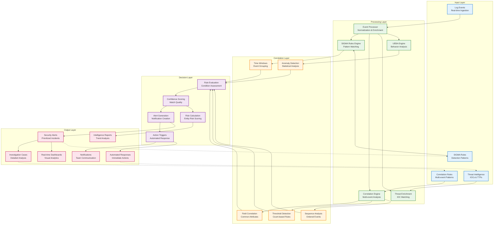
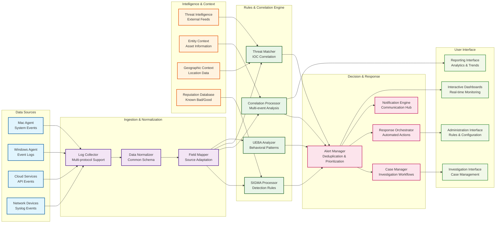

# SecureWatch SIEM - Correlation & Rules Engine ERD

**Version:** 1.0.0  
**Created:** June 2025  
**Purpose:** Entity-Relationship Diagrams for Correlation and Rules Engine Integration

## 1. Correlation Rules Engine - Complete Entity Relationship Model

```mermaid
erDiagram
    %% Core Entities
    organizations {
        UUID id PK
        VARCHAR name
        VARCHAR domain
        VARCHAR subscription_tier
        INTEGER max_users
        INTEGER max_data_retention_days
        JSONB settings
        TIMESTAMPTZ created_at
        TIMESTAMPTZ updated_at
    }
    
    users {
        UUID id PK
        UUID organization_id FK
        VARCHAR email UNIQUE
        VARCHAR username UNIQUE
        VARCHAR first_name
        VARCHAR last_name
        BOOLEAN is_active
        TIMESTAMPTZ created_at
        TIMESTAMPTZ updated_at
    }
    
    %% Logs and Events
    logs {
        UUID id PK
        TIMESTAMPTZ timestamp PARTITION_KEY
        UUID organization_id FK
        VARCHAR source_identifier
        VARCHAR source_type
        VARCHAR log_level
        TEXT message
        VARCHAR hostname
        VARCHAR process_name
        INTEGER process_id
        VARCHAR user_name
        VARCHAR event_id
        VARCHAR event_category
        INET source_ip
        INET destination_ip
        INTEGER source_port
        INTEGER destination_port
        TEXT file_path
        VARCHAR file_hash
        JSONB attributes
        TIMESTAMPTZ ingested_at
        BOOLEAN normalized
        BOOLEAN enriched
        TSVECTOR search_vector
    }
    
    %% Correlation Rules Engine
    correlation_rules {
        UUID id PK
        UUID organization_id FK
        VARCHAR name
        TEXT description
        BOOLEAN enabled
        JSONB conditions
        VARCHAR[] correlation_fields
        INTEGER time_window_ms
        INTEGER threshold
        VARCHAR action
        VARCHAR severity
        VARCHAR[] tags
        UUID created_by FK
        TIMESTAMPTZ created_at
        TIMESTAMPTZ updated_at
    }
    
    correlation_windows {
        UUID id PK
        UUID rule_id FK
        UUID organization_id FK
        TIMESTAMPTZ start_time
        TIMESTAMPTZ end_time
        INTEGER event_count
        JSONB correlation_field_values
        BOOLEAN matched
        TIMESTAMPTZ created_at
        TIMESTAMPTZ updated_at
    }
    
    correlation_matches {
        UUID id PK
        UUID rule_id FK
        UUID window_id FK
        UUID organization_id FK
        TIMESTAMPTZ timestamp
        VARCHAR severity
        INTEGER confidence
        JSONB correlation_data
        VARCHAR[] actions
        INTEGER event_count
        JSONB events_summary
        VARCHAR status
        UUID assigned_to FK
        TIMESTAMPTZ created_at
        TIMESTAMPTZ resolved_at
    }
    
    correlation_events {
        UUID correlation_match_id PK,FK
        UUID log_id PK,FK
        INTEGER sequence_order
        JSONB matched_fields
        TIMESTAMPTZ added_at
    }
    
    %% SIGMA Rules Engine
    sigma_rules {
        UUID id PK
        UUID organization_id FK
        VARCHAR title
        TEXT description
        VARCHAR status
        VARCHAR author
        VARCHAR[] references
        VARCHAR[] tags
        JSONB logsource
        JSONB detection
        VARCHAR[] falsepositives
        VARCHAR level
        VARCHAR[] fields
        BOOLEAN enabled
        UUID created_by FK
        TIMESTAMPTZ created_at
        TIMESTAMPTZ updated_at
    }
    
    sigma_rule_matches {
        UUID id PK
        UUID sigma_rule_id FK
        UUID log_id FK
        UUID organization_id FK
        TIMESTAMPTZ timestamp
        VARCHAR severity
        INTEGER confidence
        VARCHAR[] matched_conditions
        JSONB event_data
        VARCHAR status
        UUID assigned_to FK
        TIMESTAMPTZ created_at
        TIMESTAMPTZ resolved_at
    }
    
    %% Alert Management
    alert_rules {
        UUID id PK
        UUID organization_id FK
        VARCHAR name
        TEXT description
        TEXT query
        VARCHAR condition_operator
        NUMERIC condition_value
        INTERVAL time_window
        VARCHAR severity
        BOOLEAN is_active
        VARCHAR rule_type
        UUID created_by FK
        TIMESTAMPTZ created_at
        TIMESTAMPTZ updated_at
    }
    
    alerts {
        UUID id PK
        UUID rule_id FK
        UUID correlation_match_id FK
        UUID sigma_match_id FK
        UUID organization_id FK
        TIMESTAMPTZ triggered_at PARTITION_KEY
        TIMESTAMPTZ resolved_at
        VARCHAR severity
        VARCHAR status
        TEXT message
        JSONB query_result
        JSONB context
        UUID acknowledged_by FK
        TIMESTAMPTZ acknowledged_at
        UUID resolved_by FK
        TEXT notes
        JSONB metadata
        INTEGER confidence
        VARCHAR alert_source
    }
    
    %% Threat Intelligence
    threat_indicators {
        UUID id PK
        UUID organization_id FK
        VARCHAR type
        VARCHAR value
        VARCHAR source
        INTEGER confidence
        VARCHAR severity
        VARCHAR[] tags
        TIMESTAMPTZ first_seen
        TIMESTAMPTZ last_seen
        TIMESTAMPTZ expires_at
        JSONB metadata
        VARCHAR[] related_iocs
        VARCHAR tlp
        BOOLEAN active
        TIMESTAMPTZ created_at
    }
    
    threat_actor_profiles {
        UUID id PK
        UUID organization_id FK
        VARCHAR name
        VARCHAR[] aliases
        TEXT description
        VARCHAR[] motivation
        VARCHAR sophistication
        BOOLEAN active
        TIMESTAMPTZ first_seen
        TIMESTAMPTZ last_seen
        VARCHAR origin
        VARCHAR[] targeted_countries
        VARCHAR[] targeted_sectors
        VARCHAR[] ttps
        VARCHAR[] associated_malware
        UUID[] associated_indicators FK
        TIMESTAMPTZ created_at
        TIMESTAMPTZ updated_at
    }
    
    %% UEBA (User and Entity Behavior Analytics)
    entity_behavior_profiles {
        UUID id PK
        UUID organization_id FK
        VARCHAR entity_id
        VARCHAR entity_type
        JSONB baseline_behavior
        JSONB current_behavior
        INTEGER risk_score
        TIMESTAMPTZ last_updated
        JSONB peer_group
        JSONB anomaly_history
        TIMESTAMPTZ created_at
    }
    
    behavior_anomalies {
        UUID id PK
        UUID entity_profile_id FK
        UUID organization_id FK
        VARCHAR metric_name
        NUMERIC baseline_value
        NUMERIC observed_value
        NUMERIC deviation_score
        INTEGER anomaly_score
        VARCHAR severity
        TEXT description
        JSONB context
        TIMESTAMPTZ detected_at
        TIMESTAMPTZ resolved_at
        VARCHAR status
    }
    
    %% Risk Scoring
    risk_scores {
        UUID id PK
        UUID organization_id FK
        VARCHAR entity_id
        VARCHAR entity_type
        INTEGER current_score
        INTEGER previous_score
        JSONB score_breakdown
        JSONB contributing_factors
        TIMESTAMPTZ calculated_at
        TIMESTAMPTZ expires_at
        JSONB metadata
    }
    
    risk_factors {
        UUID id PK
        UUID risk_score_id FK
        VARCHAR factor_type
        VARCHAR factor_name
        INTEGER weight
        INTEGER contribution
        TEXT description
        JSONB details
        TIMESTAMPTZ detected_at
    }
    
    %% Actions and Responses
    automated_responses {
        UUID id PK
        UUID organization_id FK
        VARCHAR trigger_type
        UUID trigger_id
        VARCHAR action_type
        JSONB action_parameters
        VARCHAR status
        TEXT result_message
        JSONB execution_log
        TIMESTAMPTZ triggered_at
        TIMESTAMPTZ completed_at
        UUID initiated_by FK
    }
    
    investigation_cases {
        UUID id PK
        UUID organization_id FK
        VARCHAR case_number
        VARCHAR title
        TEXT description
        VARCHAR priority
        VARCHAR status
        UUID assigned_to FK
        UUID created_by FK
        TIMESTAMPTZ created_at
        TIMESTAMPTZ updated_at
        TIMESTAMPTZ closed_at
        JSONB metadata
    }
    
    case_events {
        UUID case_id PK,FK
        UUID event_id PK,FK
        VARCHAR event_type
        TEXT description
        UUID added_by FK
        TIMESTAMPTZ added_at
        JSONB event_data
    }
    
    %% Notification and Communication
    notification_rules {
        UUID id PK
        UUID organization_id FK
        VARCHAR name
        TEXT description
        VARCHAR trigger_type
        JSONB trigger_conditions
        VARCHAR[] notification_channels
        VARCHAR[] recipients
        JSONB message_template
        BOOLEAN enabled
        UUID created_by FK
        TIMESTAMPTZ created_at
        TIMESTAMPTZ updated_at
    }
    
    notifications {
        UUID id PK
        UUID organization_id FK
        UUID rule_id FK
        UUID trigger_event_id
        VARCHAR channel
        VARCHAR recipient
        VARCHAR subject
        TEXT message
        VARCHAR status
        TIMESTAMPTZ sent_at
        TIMESTAMPTZ delivered_at
        TEXT error_message
        JSONB metadata
    }
    
    %% Primary Relationships
    organizations ||--o{ users : "employs"
    organizations ||--o{ logs : "owns"
    organizations ||--o{ correlation_rules : "defines"
    organizations ||--o{ sigma_rules : "configures"
    organizations ||--o{ alert_rules : "maintains"
    organizations ||--o{ alerts : "receives"
    organizations ||--o{ threat_indicators : "tracks"
    organizations ||--o{ entity_behavior_profiles : "monitors"
    organizations ||--o{ risk_scores : "calculates"
    
    %% User Relationships
    users ||--o{ correlation_rules : "creates"
    users ||--o{ sigma_rules : "authors"
    users ||--o{ alert_rules : "defines"
    users ||--o{ alerts : "acknowledges"
    users ||--o{ investigation_cases : "manages"
    users ||--o{ automated_responses : "initiates"
    
    %% Correlation Engine Relationships
    correlation_rules ||--o{ correlation_windows : "creates"
    correlation_rules ||--o{ correlation_matches : "triggers"
    correlation_windows ||--o{ correlation_matches : "generates"
    correlation_matches ||--o{ correlation_events : "contains"
    correlation_matches ||--o{ alerts : "creates"
    logs ||--o{ correlation_events : "participates_in"
    
    %% SIGMA Rules Relationships
    sigma_rules ||--o{ sigma_rule_matches : "detects"
    sigma_rule_matches ||--o{ alerts : "triggers"
    logs ||--o{ sigma_rule_matches : "evaluated_by"
    
    %% Alert Relationships
    alert_rules ||--o{ alerts : "generates"
    alerts ||--o{ investigation_cases : "initiates"
    alerts ||--o{ automated_responses : "triggers"
    alerts ||--o{ notifications : "sends"
    
    %% Threat Intelligence Relationships
    threat_indicators ||--o{ correlation_matches : "enriches"
    threat_indicators ||--o{ sigma_rule_matches : "validates"
    threat_actor_profiles ||--o{ threat_indicators : "associated_with"
    
    %% UEBA Relationships
    entity_behavior_profiles ||--o{ behavior_anomalies : "detects"
    entity_behavior_profiles ||--o{ risk_scores : "contributes_to"
    behavior_anomalies ||--o{ alerts : "generates"
    
    %% Risk Scoring Relationships
    risk_scores ||--o{ risk_factors : "composed_of"
    risk_scores ||--o{ alerts : "influences"
    
    %% Case Management Relationships
    investigation_cases ||--o{ case_events : "tracks"
    case_events }o--|| logs : "references"
    case_events }o--|| alerts : "investigates"
    case_events }o--|| correlation_matches : "analyzes"
    
    %% Notification Relationships
    notification_rules ||--o{ notifications : "generates"
```

## 2. Correlation Rules Engine Data Flow



## 3. SIEM Workflow Integration Points



## 4. Database Integration Schema Extensions

### New Tables Required for Full Correlation Engine:

```sql
-- Correlation Rules Engine Tables
CREATE TABLE correlation_rules (
    id UUID PRIMARY KEY DEFAULT uuid_generate_v4(),
    organization_id UUID REFERENCES organizations(id) ON DELETE CASCADE,
    name VARCHAR(255) NOT NULL,
    description TEXT,
    enabled BOOLEAN DEFAULT true,
    conditions JSONB NOT NULL,
    correlation_fields VARCHAR[] NOT NULL,
    time_window_ms INTEGER NOT NULL DEFAULT 300000, -- 5 minutes
    threshold INTEGER NOT NULL DEFAULT 2,
    action VARCHAR(50) NOT NULL DEFAULT 'alert',
    severity VARCHAR(20) NOT NULL DEFAULT 'medium',
    tags VARCHAR[] DEFAULT '{}',
    created_by UUID REFERENCES users(id),
    created_at TIMESTAMPTZ DEFAULT CURRENT_TIMESTAMP,
    updated_at TIMESTAMPTZ DEFAULT CURRENT_TIMESTAMP
);

CREATE TABLE correlation_windows (
    id UUID PRIMARY KEY DEFAULT uuid_generate_v4(),
    rule_id UUID REFERENCES correlation_rules(id) ON DELETE CASCADE,
    organization_id UUID REFERENCES organizations(id) ON DELETE CASCADE,
    start_time TIMESTAMPTZ NOT NULL,
    end_time TIMESTAMPTZ NOT NULL,
    event_count INTEGER DEFAULT 0,
    correlation_field_values JSONB DEFAULT '{}',
    matched BOOLEAN DEFAULT false,
    created_at TIMESTAMPTZ DEFAULT CURRENT_TIMESTAMP,
    updated_at TIMESTAMPTZ DEFAULT CURRENT_TIMESTAMP
);

CREATE TABLE correlation_matches (
    id UUID PRIMARY KEY DEFAULT uuid_generate_v4(),
    rule_id UUID REFERENCES correlation_rules(id) ON DELETE CASCADE,
    window_id UUID REFERENCES correlation_windows(id) ON DELETE CASCADE,
    organization_id UUID REFERENCES organizations(id) ON DELETE CASCADE,
    timestamp TIMESTAMPTZ NOT NULL,
    severity VARCHAR(20) NOT NULL,
    confidence INTEGER NOT NULL,
    correlation_data JSONB DEFAULT '{}',
    actions VARCHAR[] DEFAULT '{}',
    event_count INTEGER NOT NULL,
    events_summary JSONB DEFAULT '{}',
    status VARCHAR(20) DEFAULT 'new',
    assigned_to UUID REFERENCES users(id),
    created_at TIMESTAMPTZ DEFAULT CURRENT_TIMESTAMP,
    resolved_at TIMESTAMPTZ
);

-- SIGMA Rules Tables
CREATE TABLE sigma_rules (
    id UUID PRIMARY KEY DEFAULT uuid_generate_v4(),
    organization_id UUID REFERENCES organizations(id) ON DELETE CASCADE,
    title VARCHAR(255) NOT NULL,
    description TEXT,
    status VARCHAR(20) DEFAULT 'experimental',
    author VARCHAR(255),
    references VARCHAR[] DEFAULT '{}',
    tags VARCHAR[] DEFAULT '{}',
    logsource JSONB NOT NULL,
    detection JSONB NOT NULL,
    falsepositives VARCHAR[] DEFAULT '{}',
    level VARCHAR(20) NOT NULL,
    fields VARCHAR[] DEFAULT '{}',
    enabled BOOLEAN DEFAULT true,
    created_by UUID REFERENCES users(id),
    created_at TIMESTAMPTZ DEFAULT CURRENT_TIMESTAMP,
    updated_at TIMESTAMPTZ DEFAULT CURRENT_TIMESTAMP
);

-- Threat Intelligence Tables
CREATE TABLE threat_indicators (
    id UUID PRIMARY KEY DEFAULT uuid_generate_v4(),
    organization_id UUID REFERENCES organizations(id) ON DELETE CASCADE,
    type VARCHAR(50) NOT NULL,
    value VARCHAR(1000) NOT NULL,
    source VARCHAR(255) NOT NULL,
    confidence INTEGER NOT NULL,
    severity VARCHAR(20) NOT NULL,
    tags VARCHAR[] DEFAULT '{}',
    first_seen TIMESTAMPTZ NOT NULL,
    last_seen TIMESTAMPTZ NOT NULL,
    expires_at TIMESTAMPTZ,
    metadata JSONB DEFAULT '{}',
    related_iocs VARCHAR[] DEFAULT '{}',
    tlp VARCHAR(10) DEFAULT 'amber',
    active BOOLEAN DEFAULT true,
    created_at TIMESTAMPTZ DEFAULT CURRENT_TIMESTAMP
);

-- UEBA Tables
CREATE TABLE entity_behavior_profiles (
    id UUID PRIMARY KEY DEFAULT uuid_generate_v4(),
    organization_id UUID REFERENCES organizations(id) ON DELETE CASCADE,
    entity_id VARCHAR(255) NOT NULL,
    entity_type VARCHAR(50) NOT NULL,
    baseline_behavior JSONB DEFAULT '{}',
    current_behavior JSONB DEFAULT '{}',
    risk_score INTEGER DEFAULT 0,
    last_updated TIMESTAMPTZ DEFAULT CURRENT_TIMESTAMP,
    peer_group JSONB DEFAULT '{}',
    anomaly_history JSONB DEFAULT '{}',
    created_at TIMESTAMPTZ DEFAULT CURRENT_TIMESTAMP
);
```

---

**Document Version:** 1.0.0  
**Last Updated:** June 2025  
**Part of:** SecureWatch SIEM Architecture Documentation

This ERD provides the complete data model for integrating correlation and rules engines into the SecureWatch SIEM platform, showing all necessary entities, relationships, and data flows for comprehensive threat detection and response.