# SecureWatch SIEM - Visual ERD Diagrams

**Version:** 1.7.0  
**Last Updated:** January 2025  
**Purpose:** Interactive visual diagrams for SecureWatch architecture  

## 1. Complete System Architecture

```mermaid
graph TB
    subgraph "Data Sources & Agents"
        MAC[Mac Agent<br/>Python 3.12+<br/>PID 22516]
        WIN[Windows Agent<br/>PowerShell/C#]
        LIN[Linux Agent<br/>Bash/Python]
        CLOUD[Cloud Agents<br/>AWS/Azure/GCP]
        API[API Integrations<br/>Third-party]
    end
    
    subgraph "Data Ingestion Layer"
        INGEST[Log Ingestion Service<br/>Express.js<br/>Port 4002]
        BUFFER[Buffer Manager<br/>Batching & Queuing]
        VALIDATOR[Data Validator<br/>Schema Validation]
        NORMALIZER[Log Normalizer<br/>Field Mapping]
    end
    
    subgraph "Storage & Persistence"
        TIMESCALE[(TimescaleDB<br/>PostgreSQL 15+<br/>**Extended Schema (100+ fields)**<br/>Time-series Optimization)]
        REDIS[(Redis Cache<br/>Query Results<br/>Session Storage)]
        ELASTIC[(Elasticsearch<br/>Full-text Search<br/>Log Indexing)]
        FILES[(File Storage<br/>Reports & Exports)]
    end
    
    subgraph "Processing & Analytics"
        SEARCH[Search API Service<br/>Express.js<br/>Port 4004]
        KQL[KQL Engine<br/>Query Processing<br/>Template System]
        ALERT[Alert Engine<br/>Rule Processing<br/>Notifications]
        ML[ML Analytics<br/>Anomaly Detection<br/>Threat Intelligence]
    end
    
    subgraph "Frontend Application"
        NEXT[Next.js 15 App<br/>React Components<br/>Port 4000]
        
        subgraph "UI Components"
            DASH[Dashboards<br/>Security Overview<br/>Custom Widgets]
            VIZ[Visualizations<br/>Heatmaps, Graphs<br/>Geo Maps]
            SEARCH_UI[KQL Search<br/>Query Editor<br/>Result Views]
            EXPLORER[Event Explorer<br/>Table Views<br/>Filtering]
        end
        
        subgraph "User Interface"
            AUTH_UI[Authentication<br/>Login/SSO<br/>User Profile]
            SETTINGS[Settings<br/>Configuration<br/>Admin Panel]
            REPORTS[Reporting<br/>Scheduled Reports<br/>Export Tools]
        end
    end
    
    subgraph "Infrastructure Services"
        DOCKER[Docker Compose<br/>Container Orchestration]
        KAFKA[Kafka<br/>Message Queue<br/>Event Streaming]
        MONITOR[Monitoring<br/>Health Checks<br/>Metrics]
        BACKUP[Backup Service<br/>Data Protection<br/>Recovery]
    end
    
    %% Data Flow Connections
    MAC -->|Real-time Logs| INGEST
    WIN -->|Event Logs| INGEST
    LIN -->|Syslog/Journal| INGEST
    CLOUD -->|API Calls| INGEST
    API -->|Webhook/REST| INGEST
    
    INGEST --> BUFFER
    BUFFER --> VALIDATOR
    VALIDATOR --> NORMALIZER
    NORMALIZER --> TIMESCALE
    NORMALIZER --> REDIS
    NORMALIZER --> ELASTIC
    
    TIMESCALE --> SEARCH
    REDIS --> SEARCH
    ELASTIC --> SEARCH
    SEARCH --> KQL
    KQL --> ALERT
    SEARCH --> ML
    
    SEARCH -->|API Responses| NEXT
    NEXT --> DASH
    NEXT --> VIZ
    NEXT --> SEARCH_UI
    NEXT --> EXPLORER
    NEXT --> AUTH_UI
    NEXT --> SETTINGS
    NEXT --> REPORTS
    
    %% Infrastructure Connections
    DOCKER -.->|Orchestrates| INGEST
    DOCKER -.->|Orchestrates| SEARCH
    DOCKER -.->|Orchestrates| TIMESCALE
    KAFKA -.->|Queuing| INGEST
    MONITOR -.->|Health Checks| SEARCH
    BACKUP -.->|Data Protection| TIMESCALE
    
    %% Styling
    classDef agent fill:#e1f5fe,stroke:#01579b,stroke-width:2px
    classDef service fill:#f3e5f5,stroke:#4a148c,stroke-width:2px
    classDef storage fill:#e8f5e8,stroke:#1b5e20,stroke-width:2px
    classDef frontend fill:#fff3e0,stroke:#e65100,stroke-width:2px
    classDef infra fill:#fafafa,stroke:#424242,stroke-width:2px
    
    class MAC,WIN,LIN,CLOUD,API agent
    class INGEST,SEARCH,KQL,ALERT,ML service
    class TIMESCALE,REDIS,ELASTIC,FILES storage
    class NEXT,DASH,VIZ,SEARCH_UI,EXPLORER,AUTH_UI,SETTINGS,REPORTS frontend
    class DOCKER,KAFKA,MONITOR,BACKUP infra
```

## 2. Database Schema Entity Relationships

```mermaid
erDiagram
    organizations {
        UUID id PK
        VARCHAR name
        VARCHAR domain
        VARCHAR subscription_tier
        INTEGER max_users
        INTEGER max_data_retention_days
        JSONB settings
        TIMESTAMPTZ created_at
        TIMESTAMPTZ updated_at
    }
    
    users {
        UUID id PK
        UUID organization_id FK
        VARCHAR email UNIQUE
        VARCHAR username UNIQUE
        VARCHAR password_hash
        VARCHAR first_name
        VARCHAR last_name
        VARCHAR display_name
        BOOLEAN is_active
        BOOLEAN is_verified
        TIMESTAMPTZ last_login_at
        JSONB preferences
        TIMESTAMPTZ created_at
        TIMESTAMPTZ updated_at
    }
    
    roles {
        UUID id PK
        UUID organization_id FK
        VARCHAR name
        VARCHAR display_name
        TEXT description
        BOOLEAN is_system
        INTEGER priority
        TIMESTAMPTZ created_at
        TIMESTAMPTZ updated_at
    }
    
    permissions {
        UUID id PK
        VARCHAR resource
        VARCHAR action
        TEXT description
        BOOLEAN is_system
        TIMESTAMPTZ created_at
    }
    
    user_roles {
        UUID user_id PK,FK
        UUID role_id PK,FK
        TIMESTAMPTZ assigned_at
        TIMESTAMPTZ expires_at
        UUID assigned_by FK
    }
    
    role_permissions {
        UUID role_id PK,FK
        UUID permission_id PK,FK
        JSONB conditions
        TIMESTAMPTZ granted_at
        UUID granted_by FK
    }
    
    logs {
        UUID id PK
        TIMESTAMPTZ timestamp PARTITION_KEY
        UUID organization_id FK
        VARCHAR source_identifier
        VARCHAR source_type
        VARCHAR log_level
        TEXT message
        VARCHAR facility
        INTEGER severity
        VARCHAR hostname
        VARCHAR process_name
        INTEGER process_id
        VARCHAR user_name
        VARCHAR event_id
        VARCHAR event_category
        VARCHAR event_subcategory
        INET source_ip
        INET destination_ip
        INTEGER source_port
        INTEGER destination_port
        VARCHAR protocol
        TEXT file_path
        VARCHAR file_hash
        VARCHAR auth_user
        VARCHAR auth_domain
        VARCHAR auth_method
        VARCHAR auth_result
        JSONB attributes
        TIMESTAMPTZ ingested_at
        TIMESTAMPTZ processed_at
        BOOLEAN normalized
        BOOLEAN enriched
        TSVECTOR search_vector
    }
    
    log_metrics {
        TIMESTAMPTZ bucket PARTITION_KEY
        UUID organization_id FK
        VARCHAR source_type
        VARCHAR log_level
        VARCHAR event_category
        BIGINT count
    }
    
    alert_rules {
        UUID id PK
        UUID organization_id FK
        VARCHAR name
        TEXT description
        TEXT query
        VARCHAR condition_operator
        NUMERIC condition_value
        INTERVAL time_window
        VARCHAR severity
        BOOLEAN is_active
        UUID created_by FK
        TIMESTAMPTZ created_at
        TIMESTAMPTZ updated_at
    }
    
    alerts {
        UUID id PK
        UUID rule_id FK
        UUID organization_id FK
        TIMESTAMPTZ triggered_at PARTITION_KEY
        TIMESTAMPTZ resolved_at
        VARCHAR severity
        VARCHAR status
        TEXT message
        JSONB query_result
        UUID acknowledged_by FK
        TIMESTAMPTZ acknowledged_at
        UUID resolved_by FK
        TEXT notes
        JSONB metadata
    }
    
    user_sessions {
        UUID id PK
        UUID user_id FK
        VARCHAR session_token UNIQUE
        VARCHAR refresh_token UNIQUE
        INET ip_address
        TEXT user_agent
        JSONB device_info
        TIMESTAMPTZ expires_at
        TIMESTAMPTZ last_activity_at
        TIMESTAMPTZ created_at
    }
    
    auth_audit_log {
        UUID id PK
        UUID user_id FK
        UUID organization_id FK
        VARCHAR event_type
        VARCHAR event_status
        INET ip_address
        TEXT user_agent
        JSONB device_info
        TEXT error_message
        JSONB metadata
        TIMESTAMPTZ created_at
    }
    
    api_keys {
        UUID id PK
        UUID organization_id FK
        VARCHAR name
        VARCHAR key_hash UNIQUE
        VARCHAR key_prefix
        JSONB permissions
        INTEGER rate_limit
        TIMESTAMPTZ expires_at
        TIMESTAMPTZ last_used_at
        BOOLEAN is_active
        UUID created_by FK
        TIMESTAMPTZ created_at
        TIMESTAMPTZ updated_at
    }
    
    %% Relationships
    organizations ||--o{ users : "has many"
    organizations ||--o{ roles : "defines"
    organizations ||--o{ logs : "owns"
    organizations ||--o{ log_metrics : "aggregates"
    organizations ||--o{ alert_rules : "configures"
    organizations ||--o{ alerts : "receives"
    organizations ||--o{ auth_audit_log : "audits"
    organizations ||--o{ api_keys : "manages"
    
    users ||--o{ user_roles : "assigned"
    users ||--o{ user_sessions : "has sessions"
    users ||--o{ auth_audit_log : "generates events"
    users ||--o{ alert_rules : "creates"
    users ||--o{ alerts : "acknowledges"
    users ||--o{ api_keys : "creates"
    
    roles ||--o{ user_roles : "assigned to users"
    roles ||--o{ role_permissions : "has permissions"
    
    permissions ||--o{ role_permissions : "granted to roles"
    
    alert_rules ||--o{ alerts : "triggers"
    
    %% TimescaleDB Hypertables
    logs ||--o{ log_metrics : "aggregated into"
```

## 3. Frontend Component Architecture


## 4. Data Flow & API Communication

```mermaid
sequenceDiagram
    participant User as 👤 User
    participant Frontend as 🌐 Frontend<br/>(Next.js)
    participant SearchAPI as 🔍 Search API<br/>(Port 4004)
    participant KQL as ⚙️ KQL Engine
    participant Cache as 💾 Redis Cache
    participant DB as 🗄️ TimescaleDB
    participant Agent as 🤖 Mac Agent
    participant Ingestion as 📥 Log Ingestion<br/>(Port 4002)
    
    Note over User,Ingestion: Real-time Data Collection
    Agent->>Ingestion: POST /api/ingest<br/>Live log events
    Ingestion->>DB: INSERT normalized logs
    Ingestion->>Cache: Update metrics cache
    
    Note over User,Ingestion: User Interaction & Query
    User->>Frontend: Open Dashboard
    Frontend->>SearchAPI: GET /api/v1/search/logs
    SearchAPI->>Cache: Check cached results
    alt Cache Hit
        Cache-->>SearchAPI: Return cached data
    else Cache Miss
        SearchAPI->>DB: SQL Query
        DB-->>SearchAPI: Result set
        SearchAPI->>Cache: Store results
    end
    SearchAPI-->>Frontend: JSON Response
    Frontend-->>User: Render Dashboard
    
    Note over User,Ingestion: KQL Search Flow
    User->>Frontend: Enter KQL Query
    Frontend->>SearchAPI: POST /api/v1/search/execute
    SearchAPI->>KQL: Parse KQL Query
    KQL->>KQL: Validate & Optimize
    KQL->>DB: Execute SQL Translation
    DB-->>KQL: Query Results
    KQL-->>SearchAPI: Formatted Results
    SearchAPI->>Cache: Cache query results
    SearchAPI-->>Frontend: Query Response
    Frontend-->>User: Visualization Update
    
    Note over User,Ingestion: Real-time Updates
    loop Every 30 seconds
        Agent->>Ingestion: Batch log events
        Ingestion->>DB: Store new logs
        Ingestion->>Frontend: WebSocket notification
        Frontend->>User: Update live widgets
    end
    
    Note over User,Ingestion: Health Monitoring
    Frontend->>SearchAPI: GET /health
    SearchAPI->>DB: SELECT 1
    SearchAPI->>Cache: PING
    SearchAPI-->>Frontend: Health Status
    Frontend->>Ingestion: GET /health
    Ingestion->>DB: Health Query
    Ingestion-->>Frontend: Service Status
```



## 5. Service Dependencies & Infrastructure


## 6. Security & Authentication Flow


## 7. Performance & Scaling Architecture


## 8. Real-time Data Pipeline


---

## 4. Extended Normalized Schema - Entity Relationship


**Document Version:** 1.7.0  
**Last Updated:** January 2025  
**Companion to:** [Entity Relationship Diagram](./ENTITY_RELATIONSHIP_DIAGRAM.md)

These visual diagrams provide interactive Mermaid representations of the SecureWatch SIEM architecture, showing relationships between components, data flows, and system dependencies. Use these diagrams for architectural planning, system understanding, and documentation purposes.