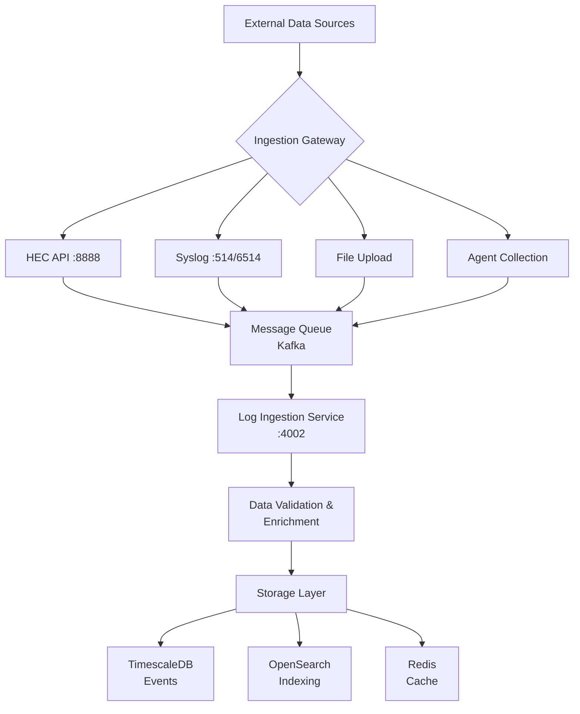
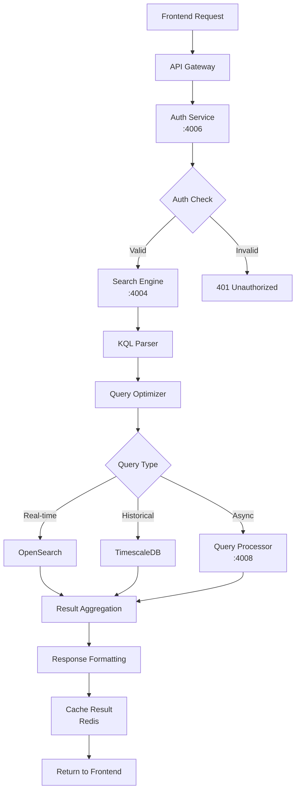
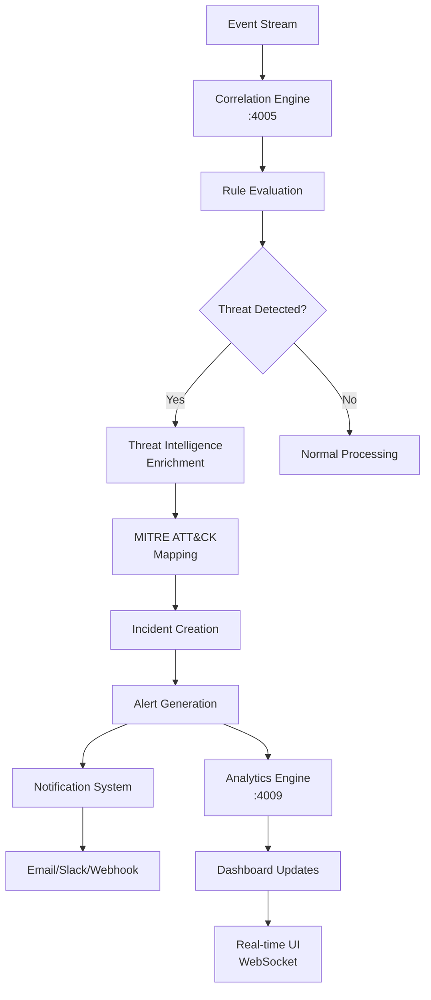

# SecureWatch SIEM Platform - Architecture Documentation

## 🏗️ System Overview

SecureWatch is an enterprise-grade Security Information and Event Management (SIEM) platform built with modern microservices architecture. The platform provides real-time security analytics, threat detection, and compliance reporting capabilities comparable to enterprise solutions like Splunk, Sentinel, and QRadar.

### **Core Platform Stats**
- **Version**: 2.1.1
- **Services**: 8 core microservices (consolidated from 12+)
- **Data Ingestion**: 1M+ events/second capability
- **Query Performance**: <100ms response time
- **Architecture**: Event-driven microservices with CQRS patterns
- **Deployment**: Docker + Kubernetes ready

---

## 🎯 High-Level Architecture

```
┌─────────────────────────────────────────────────────────────────────────┐
│                    SecureWatch SIEM Platform v2.1.1                     │
│                        (Enterprise Architecture)                        │
└─────────────────────────────────────────────────────────────────────────┘
                                    │
                                    ▼
┌─────────────────────────────────────────────────────────────────────────┐
│                          🌐 PRESENTATION LAYER                          │
├─────────────────────────────────────────────────────────────────────────┤
│  Next.js 15 Enterprise Frontend (:4000)                                │
│  ┌─────────────────┐ ┌─────────────────┐ ┌─────────────────┐          │
│  │   📊 Dashboards │ │  🔍 Search UI   │ │  ⚙️ Settings    │          │
│  │   & Analytics   │ │  & KQL Editor   │ │  & Admin Panel  │          │
│  └─────────────────┘ └─────────────────┘ └─────────────────┘          │
│                                                                         │
│  • TypeScript + ShadCN UI Components                                   │
│  • Real-time WebSocket connections                                     │
│  • Responsive design with dark/light themes                            │
│  • Progressive Web App (PWA) capabilities                              │
└─────────────────────────────────────────────────────────────────────────┘
                                    │
                                    ▼
┌─────────────────────────────────────────────────────────────────────────┐
│                           🔗 API GATEWAY LAYER                          │
├─────────────────────────────────────────────────────────────────────────┤
│  Load Balancer + API Gateway (Nginx/Traefik)                          │
│  ┌─────────────────┐ ┌─────────────────┐ ┌─────────────────┐          │
│  │  🔐 Auth Guard  │ │  📊 Rate Limit  │ │  🛡️ WAF         │          │
│  │  JWT/OAuth2     │ │  & Throttling   │ │  Protection     │          │
│  └─────────────────┘ └─────────────────┘ └─────────────────┘          │
│                                                                         │
│  • Request routing & load balancing                                    │
│  • SSL termination & security headers                                  │
│  • API versioning & documentation                                      │
└─────────────────────────────────────────────────────────────────────────┘
                                    │
                                    ▼
┌─────────────────────────────────────────────────────────────────────────┐
│                        📡 DATA INGESTION LAYER                          │
├─────────────────────────────────────────────────────────────────────────┤
│  Multi-Protocol Data Ingestion with High Availability                  │
│                                                                         │
│  ┌───────────────┐ ┌───────────────┐ ┌───────────────┐ ┌─────────────┐ │
│  │  🔥 HEC API   │ │  📨 Syslog    │ │  📁 File      │ │ 🤖 Agents   │ │
│  │  Splunk-      │ │  UDP 514      │ │  Upload       │ │ Python/Rust │ │
│  │  Compatible   │ │  TCP 514      │ │  CSV/JSON/    │ │ Enhanced    │ │
│  │  (:8888)      │ │  TLS 6514     │ │  EVTX         │ │ Collection  │ │
│  └───────────────┘ └───────────────┘ └───────────────┘ └─────────────┘ │
│                                                                         │
│  • Token-based authentication                                          │
│  • Automatic format detection & parsing                                │
│  • Guaranteed delivery with persistent queuing                         │
│  • Compression & batching optimization                                  │
└─────────────────────────────────────────────────────────────────────────┘
                                    │
                                    ▼
┌─────────────────────────────────────────────────────────────────────────┐
│                       ⚡ CORE PROCESSING SERVICES                       │
├─────────────────────────────────────────────────────────────────────────┤
│                      8 Microservices Architecture                       │
│                                                                         │
│  ┌──────────────┐ ┌──────────────┐ ┌──────────────┐ ┌──────────────┐   │
│  │📥 Log        │ │🔍 Search &   │ │🔗 Correlation│ │📊 Analytics  │   │
│  │  Ingestion   │ │  KQL Engine  │ │  Engine      │ │  Engine      │   │
│  │  (:4002)     │ │  (:4004)     │ │  (:4005)     │ │  (:4009)     │   │
│  │              │ │              │ │              │ │              │   │
│  │• Multi-format│ │• KQL Parser  │ │• Rule Engine │ │• Dashboards  │   │
│  │• Validation  │ │• Query Opt.  │ │• Incidents   │ │• Widgets     │   │
│  │• Enrichment  │ │• Aggregation │ │• Alerting    │ │• Reports     │   │
│  └──────────────┘ └──────────────┘ └──────────────┘ └──────────────┘   │
│                                                                         │
│  ┌──────────────┐ ┌──────────────┐ ┌──────────────┐ ┌──────────────┐   │
│  │🔐 Auth       │ │⚡ Query      │ │🏪 MCP        │ │💻 CLI        │   │
│  │  Service     │ │  Processor   │ │  Marketplace │ │  Dashboard   │   │
│  │  (:4006)     │ │  (:4008)     │ │  (:4010)     │ │  Enhanced    │   │
│  │              │ │              │ │              │ │              │   │
│  │• JWT/MFA     │ │• Async Jobs  │ │• Integrations│ │• Monitoring  │   │
│  │• RBAC        │ │• Background  │ │• Extensions  │ │• Control     │   │
│  │• SSO         │ │• Scheduling  │ │• Plugins     │ │• Health      │   │
│  └──────────────┘ └──────────────┘ └──────────────┘ └──────────────┘   │
└─────────────────────────────────────────────────────────────────────────┘
                                    │
                                    ▼
┌─────────────────────────────────────────────────────────────────────────┐
│                       📊 ANALYTICS & INTELLIGENCE                       │
├─────────────────────────────────────────────────────────────────────────┤
│                     Advanced Security Analytics                         │
│                                                                         │
│  ┌──────────────┐ ┌──────────────┐ ┌──────────────┐ ┌──────────────┐   │
│  │🧠 Machine    │ │🎯 Threat     │ │📋 MITRE      │ │👤 UEBA       │   │
│  │  Learning    │ │  Intelligence│ │  ATT&CK      │ │  Behavioral  │   │
│  │  Engine      │ │  Integration │ │  Mapping     │ │  Analytics   │   │
│  │              │ │              │ │              │ │              │   │
│  │• Anomaly     │ │• VirusTotal  │ │• Technique   │ │• User        │   │
│  │  Detection   │ │• AbuseIPDB   │ │  Detection   │ │  Profiling   │   │
│  │• Pattern     │ │• MISP        │ │• Kill Chain  │ │• Risk        │   │
│  │  Recognition │ │• Custom APIs │ │  Analysis    │ │  Scoring     │   │
│  └──────────────┘ └──────────────┘ └──────────────┘ └──────────────┘   │
└─────────────────────────────────────────────────────────────────────────┘
                                    │
                                    ▼
┌─────────────────────────────────────────────────────────────────────────┐
│                        💾 DATA & STORAGE LAYER                          │
├─────────────────────────────────────────────────────────────────────────┤
│                 High-Performance Storage Infrastructure                  │
│                                                                         │
│  ┌──────────────┐ ┌──────────────┐ ┌──────────────┐ ┌──────────────┐   │
│  │⏰ TimescaleDB│ │💨 Redis      │ │📡 Apache     │ │🔍 OpenSearch │   │
│  │  Time-Series │ │  Cache &     │ │  Kafka       │ │  Full-Text   │   │
│  │  Database    │ │  Message     │ │  Streaming   │ │  Search      │   │
│  │  (:5432)     │ │  Queue       │ │  Platform    │ │  (:9200)     │   │
│  │              │ │  (:6379)     │ │  (:9092)     │ │              │   │
│  │• Event Data  │ │• Sessions    │ │• Real-time   │ │• Log Search  │   │
│  │• Metrics     │ │• Cache       │ │  Processing  │ │• Aggregation │   │
│  │• Compression │ │• Pub/Sub     │ │• Partitioning│ │• Visualization│   │
│  │• Retention   │ │• Clustering  │ │• Replication │ │• Alerting    │   │
│  └──────────────┘ └──────────────┘ └──────────────┘ └──────────────┘   │
└─────────────────────────────────────────────────────────────────────────┘
                                    │
                                    ▼
┌─────────────────────────────────────────────────────────────────────────┐
│                    🚀 DEPLOYMENT & INFRASTRUCTURE                       │
├─────────────────────────────────────────────────────────────────────────┤
│                Multi-Environment Deployment Strategy                    │
│                                                                         │
│  ┌──────────────┐ ┌──────────────┐ ┌──────────────┐ ┌──────────────┐   │
│  │🐳 Docker     │ │☸️ Kubernetes  │ │🔧 Terraform  │ │📊 Monitoring │   │
│  │  Containers  │ │  Orchestration│ │  IaC         │ │  & Observ.   │   │
│  │              │ │              │ │              │ │              │   │
│  │• Multi-stage │ │• HPA         │ │• AWS/Azure   │ │• Prometheus  │   │
│  │  Builds      │ │• Rolling     │ │• Resource    │ │• Grafana     │   │
│  │• Health      │ │  Updates     │ │  Management  │ │• Alerting    │   │
│  │  Checks      │ │• Service     │ │• State Mgmt  │ │• Logging     │   │
│  │              │ │  Mesh        │ │              │ │              │   │
│  └──────────────┘ └──────────────┘ └──────────────┘ └──────────────┘   │
└─────────────────────────────────────────────────────────────────────────┘
```

---

## 🔄 Data Flow Architecture

### **1. Data Ingestion Flow**


### **2. Query Processing Flow**


### **3. Alert & Correlation Flow**


---

## 🏗️ Service Architecture Details

### **Core Services Breakdown**

#### **1. Frontend Service (:4000)**
```typescript
// Next.js 15 App Router Architecture
├── app/
│   ├── (dashboard)/           // Protected dashboard routes
│   │   ├── analytics/         // Real-time analytics
│   │   ├── search/           // KQL search interface
│   │   ├── incidents/        // Security incidents
│   │   └── settings/         // Configuration
│   ├── api/                  // API routes
│   │   ├── auth/            // Authentication endpoints
│   │   ├── search/          // Search proxy
│   │   └── websocket/       // Real-time connections
│   └── components/          // Reusable UI components
│       ├── charts/          // Analytics visualizations
│       ├── forms/           // Data input forms
│       └── tables/          // Data display tables

// Key Features:
- Server-side rendering (SSR) + Static generation (SSG)
- Real-time WebSocket connections for live updates
- Progressive Web App (PWA) capabilities
- Responsive design with dark/light themes
- Component-based architecture with ShadCN UI
```

#### **2. Log Ingestion Service (:4002)**
```go
// Multi-format log processing pipeline
type LogProcessor struct {
    Parser      FormatParser     // Auto-detect format (JSON, CEF, Syslog)
    Validator   DataValidator    // Schema validation
    Enricher    ThreatIntel     // IP/Hash enrichment
    Normalizer  DataNormalizer  // Common schema mapping
    Storage     StorageManager  // Multi-destination routing
}

// Supported Formats:
- Syslog (RFC 3164, RFC 5424)
- Common Event Format (CEF)
- JSON structured logs
- Windows Event Logs (EVTX)
- CSV/TSV formats
- Custom parsers via plugins
```

#### **3. Search & KQL Engine (:4004)**
```sql
-- KQL Query Processing Architecture
KQL Query → Parser → AST → Optimizer → Execution Plan → Results

-- Supported KQL Operations:
| where TimeGenerated > ago(24h)
| where EventID == 4625
| summarize count() by Computer, Account
| order by count_ desc
| extend RiskScore = case(count_ > 100, "High", "Medium")
| project TimeGenerated, Computer, Account, RiskScore

-- Performance Optimizations:
- Query plan caching
- Index hint optimization
- Parallel execution
- Result set pagination
```

#### **4. Correlation Engine (:4005)**
```yaml
# Rule-based correlation configuration
rules:
  - name: "Credential Stuffing Detection"
    condition: |
      EventID == 4625 AND 
      count(distinct Account) > 50 AND 
      timespan(1h)
    severity: "High"
    mitre_technique: "T1110.003"
    
  - name: "Lateral Movement Detection"
    condition: |
      EventID == 4624 AND
      LogonType == 3 AND
      sequence_detection(Computer, 5m)
    severity: "Medium"
    mitre_technique: "T1021"
```

#### **5. Auth Service (:4006)**
```javascript
// JWT-based authentication with RBAC
const authFlow = {
  authentication: {
    methods: ['local', 'oauth2', 'saml', 'ldap'],
    mfa: ['totp', 'sms', 'email'],
    sessions: 'redis-backed'
  },
  authorization: {
    model: 'RBAC',
    permissions: ['read', 'write', 'admin', 'audit'],
    scopes: ['logs', 'dashboards', 'settings', 'users']
  }
}
```

#### **6. Query Processor (:4008)**
```python
# Async job processing with Celery
@app.task(bind=True, max_retries=3)
def process_large_query(self, query_id, kql_query, time_range):
    try:
        # Execute long-running queries asynchronously
        result = execute_kql_query(kql_query, time_range)
        cache.set(f"query:{query_id}", result, timeout=3600)
        notify_completion(query_id)
    except Exception as exc:
        raise self.retry(exc=exc, countdown=60)
```

#### **7. Analytics Engine (:4009)**
```typescript
// Real-time dashboard and visualization engine
interface AnalyticsEngine {
  widgets: {
    timeSeries: TimeSeriesWidget;
    heatmap: HeatmapWidget;
    geolocation: GeoWidget;
    network: NetworkGraphWidget;
  };
  
  realtime: {
    websocket: WebSocketManager;
    streaming: KafkaConsumer;
    aggregation: StreamProcessor;
  };
  
  export: {
    formats: ['PDF', 'Excel', 'CSV', 'JSON'];
    scheduling: CronScheduler;
    delivery: EmailDelivery;
  };
}
```

#### **8. MCP Marketplace (:4010)**
```json
{
  "integrations": {
    "threat_intelligence": [
      "VirusTotal", "AbuseIPDB", "MISP", "CrowdStrike"
    ],
    "ticketing": [
      "ServiceNow", "Jira", "PagerDuty"
    ],
    "communication": [
      "Slack", "Microsoft Teams", "Email"
    ],
    "siem": [
      "Splunk", "QRadar", "Sentinel"
    ]
  }
}
```

---

## 🗄️ Database Schema Architecture

### **TimescaleDB Schema (Primary Event Storage)**
```sql
-- Hypertable for high-volume event ingestion
CREATE TABLE security_events (
    time TIMESTAMPTZ NOT NULL,
    event_id UUID PRIMARY KEY,
    source_ip INET,
    dest_ip INET,
    event_type VARCHAR(50),
    severity INTEGER,
    raw_event JSONB,
    normalized_event JSONB,
    enrichment JSONB,
    INDEX idx_time_source (time, source_ip),
    INDEX idx_event_type_time (event_type, time)
);

-- Convert to hypertable for time-series optimization
SELECT create_hypertable('security_events', 'time');

-- Compression policy for cost optimization
SELECT add_compression_policy('security_events', INTERVAL '7 days');

-- Retention policy for compliance
SELECT add_retention_policy('security_events', INTERVAL '2 years');
```

### **Redis Schema (Caching & Sessions)**
```redis
# Session storage
session:{user_id} → {jwt_token, permissions, last_activity}

# Query result caching
query:{hash} → {results, expiry}

# Real-time counters
counter:events:hourly:{hour} → {count}
counter:alerts:daily:{date} → {count}

# Threat intelligence cache
threat:ip:{ip_address} → {reputation, last_check}
threat:hash:{hash} → {malware_info, vendors}
```

### **OpenSearch Index Mapping**
```json
{
  "mappings": {
    "properties": {
      "@timestamp": {"type": "date"},
      "source_ip": {"type": "ip"},
      "dest_ip": {"type": "ip"},
      "event_type": {"type": "keyword"},
      "message": {
        "type": "text",
        "analyzer": "security_analyzer"
      },
      "geo_location": {"type": "geo_point"},
      "mitre_technique": {"type": "keyword"},
      "severity": {"type": "integer"}
    }
  }
}
```

---

## 🔌 API Architecture

### **RESTful API Endpoints**

#### **Authentication API**
```http
POST /api/v1/auth/login
POST /api/v1/auth/logout
POST /api/v1/auth/refresh
GET  /api/v1/auth/profile
PUT  /api/v1/auth/password
```

#### **Search API**
```http
POST /api/v1/search/kql
GET  /api/v1/search/history
POST /api/v1/search/export
GET  /api/v1/search/status/{job_id}
```

#### **Analytics API**
```http
GET  /api/v1/analytics/dashboards
POST /api/v1/analytics/widgets
GET  /api/v1/analytics/metrics
POST /api/v1/analytics/reports
```

#### **Administration API**
```http
GET  /api/v1/admin/health
GET  /api/v1/admin/metrics
POST /api/v1/admin/config
GET  /api/v1/admin/logs
```

### **WebSocket Event Streams**
```javascript
// Real-time event streaming
ws://localhost:4000/ws/events
- event_stream: Real-time security events
- alert_stream: Security alerts and incidents
- metric_stream: Performance and system metrics
- dashboard_stream: Dashboard updates

// Message format
{
  "type": "security_event",
  "timestamp": "2025-06-10T10:30:00Z",
  "severity": "high",
  "data": { /* event details */ }
}
```

---

## 🚀 Deployment Architecture

### **Development Environment**
```yaml
# docker-compose.dev.yml structure
services:
  - frontend (Next.js)           # :4000
  - log-ingestion               # :4002
  - search-api                  # :4004
  - correlation-engine          # :4005
  - auth-service               # :4006
  - query-processor            # :4008
  - analytics-engine           # :4009
  - mcp-marketplace            # :4010
  - hec-service                # :8888
  
infrastructure:
  - postgres (TimescaleDB)      # :5432
  - redis                      # :6379
  - kafka + zookeeper          # :9092
  - opensearch                 # :9200
```

### **Production Kubernetes Architecture**
```yaml
# Kubernetes deployment structure
apiVersion: v1
kind: Namespace
metadata:
  name: securewatch-prod

---
# Microservices deployment
apps:
  - name: frontend
    replicas: 3
    resources:
      requests: { cpu: 200m, memory: 512Mi }
      limits: { cpu: 500m, memory: 1Gi }
    
  - name: search-api
    replicas: 2
    resources:
      requests: { cpu: 500m, memory: 1Gi }
      limits: { cpu: 1000m, memory: 2Gi }

# Auto-scaling configuration
apiVersion: autoscaling/v2
kind: HorizontalPodAutoscaler
spec:
  scaleTargetRef:
    apiVersion: apps/v1
    kind: Deployment
    name: search-api
  minReplicas: 2
  maxReplicas: 10
  metrics:
  - type: Resource
    resource:
      name: cpu
      target:
        type: Utilization
        averageUtilization: 70
```

### **Cloud Infrastructure (Terraform)**
```hcl
# AWS infrastructure setup
module "securewatch_infrastructure" {
  source = "./modules/securewatch"
  
  # EKS cluster configuration
  cluster_name = "securewatch-prod"
  node_groups = {
    general = {
      instance_types = ["t3.large", "t3.xlarge"]
      min_size      = 3
      max_size      = 20
      desired_size  = 6
    }
  }
  
  # RDS for TimescaleDB
  database = {
    instance_class = "db.r5.2xlarge"
    storage_size   = 500
    backup_window  = "03:00-04:00"
  }
  
  # ElastiCache for Redis
  redis = {
    node_type = "cache.r6g.large"
    num_nodes = 3
  }
}
```

---

## 📊 Performance & Monitoring

### **Key Performance Indicators**
```yaml
performance_targets:
  ingestion:
    rate: "1M events/second"
    latency: "<10ms p99"
    
  search:
    response_time: "<100ms p95"
    concurrent_users: "1000+"
    
  availability:
    uptime: "99.9%"
    recovery_time: "<5 minutes"
    
  storage:
    compression_ratio: "70%"
    retention_policy: "2 years"
```

### **Monitoring Stack**
```yaml
observability:
  metrics:
    - prometheus: System and application metrics
    - grafana: Visualization and alerting
    - node_exporter: System-level metrics
    
  logging:
    - fluentd: Log collection and forwarding
    - elasticsearch: Log storage and search
    - kibana: Log visualization
    
  tracing:
    - jaeger: Distributed tracing
    - opentelemetry: Trace collection
    
  alerting:
    - alertmanager: Alert routing
    - pagerduty: Incident management
    - slack: Team notifications
```

---

## 🔐 Security Architecture

### **Security Controls**
```yaml
security_layers:
  network:
    - waf: Web Application Firewall
    - ddos_protection: Rate limiting and traffic analysis
    - vpc: Private networking with security groups
    
  application:
    - authentication: Multi-factor authentication
    - authorization: Role-based access control
    - encryption: TLS 1.3 for data in transit
    
  data:
    - encryption_at_rest: AES-256 for stored data
    - data_masking: PII protection and anonymization
    - backup_encryption: Encrypted backup storage
    
  compliance:
    - audit_logging: Complete activity tracking
    - data_retention: Configurable retention policies
    - access_controls: Least privilege principles
```

### **Threat Detection Framework**
```yaml
detection_capabilities:
  mitre_attack:
    - tactics: 14 MITRE ATT&CK tactics covered
    - techniques: 150+ techniques detected
    - data_sources: 25+ data source types
    
  correlation_rules:
    - behavioral: User and entity behavior analytics
    - statistical: Statistical anomaly detection
    - signature: IOC and pattern matching
    
  threat_intelligence:
    - feeds: 10+ commercial and open source feeds
    - enrichment: Automatic IP/domain/hash lookup
    - scoring: Risk-based threat scoring
```

---

## 🔄 Integration Architecture

### **External System Integrations**
```yaml
integrations:
  siem_platforms:
    - splunk: HEC API compatibility
    - qradar: DSM and log source integration
    - sentinel: KQL query compatibility
    
  threat_intelligence:
    - virustotal: Hash and URL reputation
    - abuseipdb: IP reputation scoring
    - misp: Threat intelligence sharing
    
  ticketing_systems:
    - servicenow: Incident management
    - jira: Issue tracking
    - pagerduty: Alert escalation
    
  communication:
    - slack: Real-time notifications
    - email: Report delivery
    - webhook: Custom integrations
```

### **Data Export & Compliance**
```yaml
export_capabilities:
  formats:
    - csv: Structured data export
    - json: API-compatible format
    - pdf: Executive reporting
    - siem: Native SIEM formats
    
  compliance_reports:
    - sox: Sarbanes-Oxley compliance
    - pci_dss: Payment card industry
    - hipaa: Healthcare data protection
    - gdpr: General data protection regulation
```

---

## 🔧 Development & DevOps

### **CI/CD Pipeline Architecture**
```yaml
# .github/workflows/main.yml
pipeline_stages:
  1. code_quality:
     - eslint: Code linting
     - typescript: Type checking
     - jest: Unit testing
     
  2. security_scanning:
     - snyk: Dependency vulnerabilities
     - codeql: Code security analysis
     - docker_scan: Container image security
     
  3. build_and_test:
     - docker_build: Multi-stage container builds
     - integration_tests: Service integration testing
     - performance_tests: Load and stress testing
     
  4. deployment:
     - staging: Automated staging deployment
     - production: Manual approval + deployment
     - rollback: Automatic rollback on failure
```

### **Local Development Setup**
```bash
# Enhanced development workflow
make claude-setup     # Initialize Claude Code environment
make dev             # Start development services
make test            # Run comprehensive test suite
make build           # Build all services and packages
make deploy          # Deploy to staging environment
```

---

## 📚 Additional Resources

### **Documentation Links**
- **Architecture Decision Records**: `/docs/adr/`
- **API Documentation**: `/docs/api/`
- **Deployment Guides**: `/docs/deployment/`
- **Security Guidelines**: `/docs/security/`
- **Performance Tuning**: `/docs/performance/`

### **Monitoring Dashboards**
- **System Health**: `http://localhost:3000/d/system`
- **Application Metrics**: `http://localhost:3000/d/apps`
- **Security Events**: `http://localhost:3000/d/security`
- **Performance**: `http://localhost:3000/d/performance`

---

*This architecture documentation is maintained as part of the SecureWatch SIEM platform and should be updated with any significant architectural changes.*